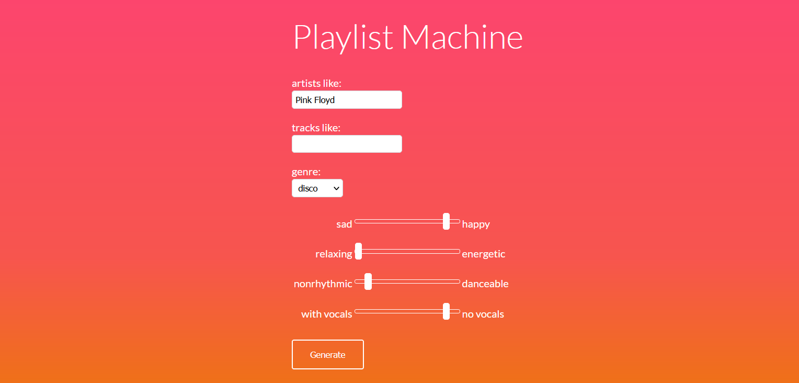
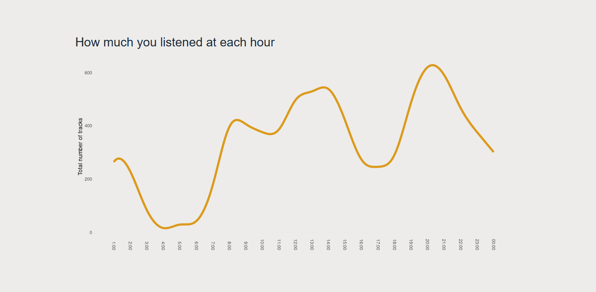

[🇬🇧](https://eluczak.github.io) [🇩🇪](https://eluczak.github.io/de)

## My projects

**Playlist Machine**\
A web app that creates playlists based on selected artist, track and genre. You can also set up audio features. This app lets you find music that is similar to artist you like, but e.g. more rythmic or upbeat.\
Tools: Python (Flask), Spotify Web API.

* [github](http://github.com/eluczak/playlist-machine) 

**Explorify**\
A dashboard web app that visualises your listening history in Spotify, without the need to login. Main features: top artists, tracks, hourly and monthly charts.\
Tools: R, Shiny.

* [project page](https://eluczak.github.io/explorify/)
* [live app](https://eluczak.shinyapps.io/explorify/)

Besides my own projects, I enjoy helping others at [Stack Overflow](https://stackoverflow.com/users/9472575). Sometimes it's me who's the asker though :) but answering is more fun.

## Skills

Data wrangling, data visualisation

**Tools:**  MS Excel, Qlik, SQL, Python, R, regular expressions\
**Foreign languages:** Polish (native), English (B2), German (B1)\
**Other:** attention to detail, teaching skills

## Contact

[Linkedin](https://www.linkedin.com/in/ewelina-luczak)

ewelina.luczak\
(at) gmail (dot) com

